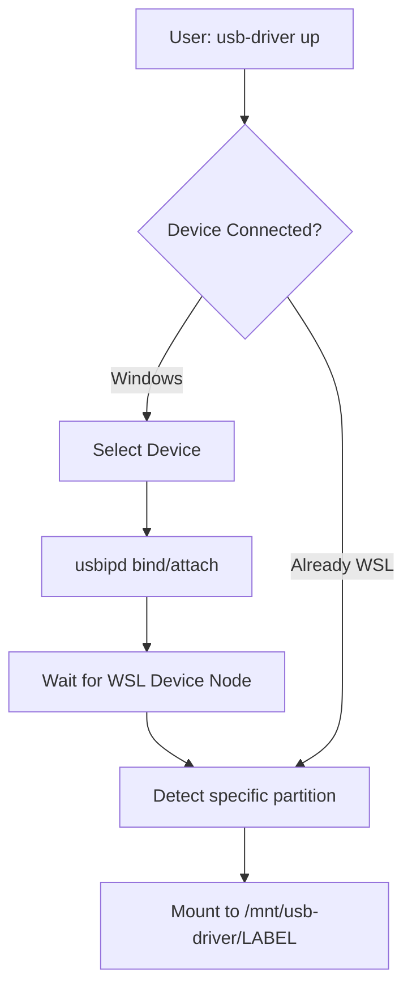

# usb-driver: Architecture

## High-Level Workflow

## System Layers

### 1. Presentation Layer (`bin/usb-driver`)
- Bash script handling command-line arguments.
- Interactive TUI for multi-device selection.
- Versioning and configuration migration (legacy path support).

### 2. Integration Layer (`lib/usbipd.sh`)
- Interfaces with `powershell.exe` to execute `usbipd` commands.
- Handles the state machine of USBIPD (Attached, Shared, NotShared).

### 3. Logic Layer (`lib/mount_ext4.sh`)
- **Detection**: Iterates through `/sys/bus/usb/devices` and `/sys/block` to map VID:PID to block devices.
- **Safety**: Robust regex-based checks for partitions and mount points.
- **Mounting**: Executes `mount -t [type]` with appropriate options (e.g., `utf8`, `uid`, `gid`).

### 4. Infrastructure Layer (`lib/checks.sh`, `lib/tui.sh`)
- Ensures `usbipd-win` and `ntfs-3g` are available.
- Provides consistent logging and colorful output.

## Design Decisions

- **VID:PID Pinning**: Crucial because WSL assigns `/dev/sdX` nodes dynamically. By using VID:PID, we ensure the device that the user selected in the "Windows world" is the one we mount in the "Linux world".
- **Dynamic Mount Points**: Mounts are placed under `/mnt/usb-driver/<LABEL>` (or serial number if label is missing) to allow simultaneous multiple mounts.
- **UAC Elevation**: Uses `Start-Process -Verb RunAs` via PowerShell to avoid requiring the entire WSL terminal to run as Administrator.
